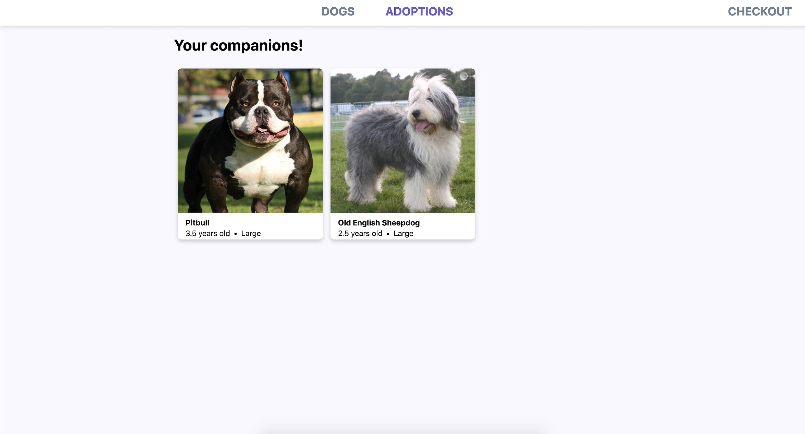
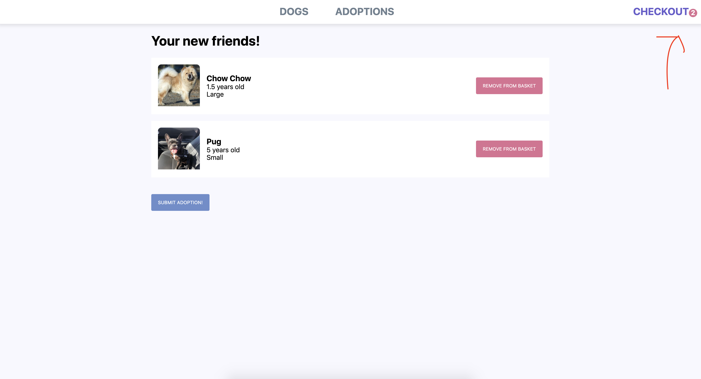

# Task Interview (doggify)

Pair programming for front-end candidates

## The Rules 📐

- You will have 90 min to get as much done as you can
- Searching online is allowed
- Asking questions is allowed and encouraged
- Best coding practices are encouraged
- Using Javascript libraries is allowed, ask to your interviewer first
- Using UI libraries is not allowed
- We recommend to follow specs in the given order
- Remember `Perfection is always the best option, but isn't strongly required.`.

## Prepare your environment 💻

Make sure your system meets the following requirements:

- node >= 10.16.3
- npm >= 6.12.0
- a [modern browser](https://browsehappy.com/)

## Launch the API 🚀

Install required packages:

Go into the api directory

```bash
$ cd api/
```

Install dependencies

```bash
$ npm install
```

Use the following command to run the app:

```bash
$ npm start
```

Once it starts, the api should be running on `localhost:3333`. Check `/docs` for the documentation.

## HTML & CSS

The layout is pretty simple. You don't need any css library, right? 😉 

**Spec**

1. A navigation menu displaying three links: Dogs, Adoptions and Checkout. (Dogs has the "current" state).


2. Homepage (Dogs):

    1. It should display images and information about the dogs in a 3-column layout.
    2. The images must appear with the same proportions on the UI (even though they originally have variant resolutions!).
    3. Below the image/info, an `Adopt` button.


3. Adoptions should display a list of adopted dogs in a similar manner as the homepage (without any `Adopt` buttons though!).



4. Checkout:

    As if this were a shop, the checkout page should serve as a way to display the dogs you want to adopt.

    1. It should display the "dogs to adopt" in a list manner.
    2. Each list item must contain a `Remove from Basket` button.
    3. The checkout navigation item should have a small badge displaying the number of items (dogs) that are in your basket.
    4. A button on the bottom for submitting your adoption!



## JS

Let's start adding functionality to our app!

Our first functional requirement is pretty obvious: we need to change the page rendered 📺.

1. By default Dogs page should be displayed.
2. When "Adoptions" link is clicked, Adoptions section should be displayed.
3. The same for "Checkout" link, when clicked display Checkout section.

`💡 Note: Updating the url is not required, but nice to have.`

## Asynchrounous JavaScript

Now our app should interact with the API service.

**Spec**

1. Dogs:

  - Use the service provided to get and display the list of dogs.
  - "Adopt" button should add the dog to the basket (checkout) and remove it from the list of Dogs.

`💡 Note: Earn bonus points by adding a "Loading" message!`

2. Adoptions:

  - Use the service provided to retrieve and display all adoptions.

3. Checkout:

  - "Remove from Basket" button remove the dog from checkout and put it back into the list of Dogs.
  - "Submit" button should interact with backend and add the dogs to adoptions.

The backend API is pretty simple: When running the server you can check the details here: [http://localhost:3333/docs/](http://localhost:3333/docs/).

**💡 Note:** If you need to clean out the adoptions in your client, just restart the server!

## Unit Testing

Shouldn't all code be tested it? 🔨

Show us how you test your code. Here functionality examples you can test:

1. Components
2. Buttons callbacks.
3. Asynchronous methods with a stub for the api service.

Easy Peasy huh? Good luck and feel free to ask any questions! 👾
